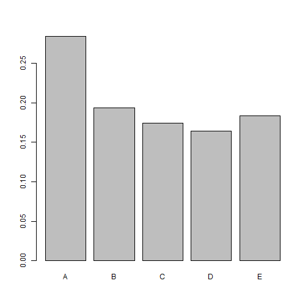

### Experiment: Weight-lifting 

The motivation for the investigation was to analyse the cause of differing quality in weight-lifting techniques.
With systematic grouping of observations of the methods used by the chosen weight-lifters, a dataset was collected
and for each set of observation one of five quality grades was assigned.
The resulting dataset was published in 2013 (acknowledged below).

### Statistical Analysis:

### *Approach*
We wish to find the best model for predicting classes of weight-lifting exercises based on the most significant 
factors (predictors).
The statistical packets, developed for "machine learning", such as caret, rpart and randomForest, can be used to 
formulate an optimal model.

### *Data analysis and conversion*
The data provided included 19621 observations of 160 variables, the first 7 of which were identifiers and 
experimental design factors, and the last of which was the response to the remaining variables, the predictors.
The data was quite "sparse" since for many variables either data was missing or not assigned. On removal of those
factors for which values were missing, there remained 52 parameters to analyse as predictors.
Of the two models developed using rpart and ransdomForest on 60% of the chosen data, randomForest produced the highest prediction accuracy 
and lowest errors on cross validation with the other 40% of the data. 
Therefore this model was used to operate on the assignment's test data in calculating the response, that is, the 
classification of the weight-lifting exercises, to be submitted for grading.

*Acknowledgement*:
http://groupware.les.inf.puc-rio.br/har (see the section on the Weight Lifting Exercise Dataset)
Velloso, E.; Bulling, A.; Gellersen, H.; Ugulino, W.; Fuks, H. Qualitative Activity Recognition of 
Weight Lifting Exercises. Proceedings of 4th International Conference in Cooperation with SIGCHI 
(Augmented Human '13) . Stuttgart, Germany: ACM SIGCHI, 2013.

###Loading libraries and exploring the loaded data:

```r
library(knitr)
library(ggplot2)
library(lattice)
library(caret)
library(e1071)
library(rpart)
library(randomForest)
```

```
## randomForest 4.6-12
## Type rfNews() to see new features/changes/bug fixes.
```

```r
projectTrain <-read.csv("pml-training.csv", stringsAsFactors=FALSE)
projectTest <-read.csv("pml-testing.csv", stringsAsFactors=FALSE)
dim(projectTrain)
```

```
## [1] 19622   160
```

```r
dim(projectTest)
```

```
## [1]  20 160
```
Interpreting blank entries as not assigned ("NA") simply by re-loading the data in the uniform format:


```r
projectTrain <-read.csv("pml-training.csv", na.strings=c("NA",""), strip.white = T, stringsAsFactors=FALSE)
projectTest <-read.csv("pml-testing.csv", na.strings=c("NA",""), strip.white = T, stringsAsFactors=FALSE)
dim(projectTrain)
```

```
## [1] 19622   160
```

```r
dim(projectTest)
```

```
## [1]  20 160
```

```r
barplot(prop.table(table(projectTrain$classe)))
```

 

The number of missing entries in both datasets is calculated in order to decide which variables may justifiably be
ignored in the model.

```r
sumNAtrain <- apply(projectTrain, 2, function(x) { sum(is.na(x)) }) 
sumNAtest <- apply(projectTest, 2, function(x) { sum(is.na(x)) })
Training <- subset(projectTrain[, which(sumNAtrain == 0)])
Testing  <- subset(projectTest[, which(sumNAtest == 0)])
```
It is obvious that the first 7 columns are identfiers and experimental design constants, rather than observations, are therefore 
eliminated from the two datasets. 


```r
trainSet <- Training[,8:60]
testSet <- Testing[,8:60]
dim(trainSet)
```

```
## [1] 19622    53
```

```r
dim(testSet)
```

```
## [1] 20 53
```
The last (53rd. column) contains the response "classe" in this training dataset, trainSet, while it contains 
the identification, "problem_id", in the assignment's test dataset, testSet. 
In order to choose between models with the classification tree (rpart) and the Random Forest (rf), the training 
set will be divided into the partial training set and the model testing set on the recommended 60-40% basis 
using the slicing function, createDataPartition, in the caret package.


```r
partition <- createDataPartition(trainSet$classe, p = 0.60, list=FALSE)
trainPart <- trainSet[partition,]
testPart  <- trainSet[-partition,]
```
The resulting training dataset will be used to measure the out of sample fit.

```r
dim(trainPart)
```

```
## [1] 11776    53
```

```r
dim(testPart)
```

```
## [1] 7846   53
```

```r
trainPart$classe <- as.factor(trainPart$classe)
table(trainPart$classe)
```

```
## 
##    A    B    C    D    E 
## 3348 2279 2054 1930 2165
```
*Creating the models*

```r
set.seed(2024)
modelRpart <- train(classe ~., method="rpart", data=trainPart)
modelRForest <-randomForest(classe~., data=trainPart, type="class")
```

*Comparing the out of sample accuracey with each model*

```r
confusionMatrix(testPart$classe, predict(modelRpart, testPart))
```

```
## Confusion Matrix and Statistics
## 
##           Reference
## Prediction    A    B    C    D    E
##          A 1991   38  169    0   34
##          B  625  403  490    0    0
##          C  645   22  701    0    0
##          D  595  227  464    0    0
##          E  210   78  480    0  674
## 
## Overall Statistics
##                                           
##                Accuracy : 0.4804          
##                  95% CI : (0.4693, 0.4915)
##     No Information Rate : 0.5182          
##     P-Value [Acc > NIR] : 1               
##                                           
##                   Kappa : 0.3215          
##  Mcnemar's Test P-Value : NA              
## 
## Statistics by Class:
## 
##                      Class: A Class: B Class: C Class: D Class: E
## Sensitivity            0.4897  0.52474  0.30425       NA  0.95198
## Specificity            0.9362  0.84247  0.87965   0.8361  0.89241
## Pos Pred Value         0.8920  0.26548  0.51243       NA  0.46741
## Neg Pred Value         0.6304  0.94232  0.75255       NA  0.99469
## Prevalence             0.5182  0.09788  0.29365   0.0000  0.09024
## Detection Rate         0.2538  0.05136  0.08934   0.0000  0.08590
## Detection Prevalence   0.2845  0.19347  0.17436   0.1639  0.18379
## Balanced Accuracy      0.7130  0.68360  0.59195       NA  0.92219
```

```r
confusionMatrix(testPart$classe, predict(modelRForest, testPart))
```

```
## Confusion Matrix and Statistics
## 
##           Reference
## Prediction    A    B    C    D    E
##          A 2226    2    3    0    1
##          B   12 1503    3    0    0
##          C    0    7 1355    6    0
##          D    0    0   16 1270    0
##          E    0    0    2    5 1435
## 
## Overall Statistics
##                                           
##                Accuracy : 0.9927          
##                  95% CI : (0.9906, 0.9945)
##     No Information Rate : 0.2852          
##     P-Value [Acc > NIR] : < 2.2e-16       
##                                           
##                   Kappa : 0.9908          
##  Mcnemar's Test P-Value : NA              
## 
## Statistics by Class:
## 
##                      Class: A Class: B Class: C Class: D Class: E
## Sensitivity            0.9946   0.9940   0.9826   0.9914   0.9993
## Specificity            0.9989   0.9976   0.9980   0.9976   0.9989
## Pos Pred Value         0.9973   0.9901   0.9905   0.9876   0.9951
## Neg Pred Value         0.9979   0.9986   0.9963   0.9983   0.9998
## Prevalence             0.2852   0.1927   0.1758   0.1633   0.1830
## Detection Rate         0.2837   0.1916   0.1727   0.1619   0.1829
## Detection Prevalence   0.2845   0.1935   0.1744   0.1639   0.1838
## Balanced Accuracy      0.9968   0.9958   0.9903   0.9945   0.9991
```
It can be seen how all fitting parameters in the Random Forest model are superior to those of the Classification 
Tree method. The accuracy of the former (99%) is in fact double that of the latter model (49%). 
Therefore the Random Forest model is chosen for the final model.
The importance of the variable can be seen using the function impVar, as follows:


```r
importPredictors <-varImp(modelRForest)
index <- order(importPredictors$Overall,decreasing=TRUE)
tablePred <-cbind(rownames(importPredictors),importPredictors)
decImportPredictors <-tablePred[index,]
rownames(decImportPredictors) <- c()
colnames(decImportPredictors) <- c("Exercise", "Overall")
head(decImportPredictors, 15)
```

```
##             Exercise  Overall
## 1          roll_belt 733.6578
## 2           yaw_belt 514.6571
## 3      pitch_forearm 477.0928
## 4  magnet_dumbbell_z 455.6620
## 5         pitch_belt 418.2313
## 6  magnet_dumbbell_y 397.8560
## 7       roll_forearm 357.3462
## 8  magnet_dumbbell_x 295.3675
## 9   accel_dumbbell_y 259.7348
## 10      accel_belt_z 241.9652
## 11     magnet_belt_y 241.4518
## 12     magnet_belt_z 237.0493
## 13     roll_dumbbell 232.8134
## 14  accel_dumbbell_z 199.6409
## 15   accel_forearm_x 195.9684
```
The final model is applied to the completely independent test data provided by the assignment. 

##Result:

```r
testAnswer <-predict(modelRForest,newdata=testSet)

pml_write_files = function (x) {
          n = length(x)
          for (i in 1:n) {
                filename = paste0('problem_id_',i,'.txt')
                write.table(x[i], file=filename, quote=FALSE, 
                                  row.names=FALSE, col.names=FALSE)
                }
          }
answers <- as.character(testAnswer)
pml_write_files(answers)
```
The files produced contain the prediction of the model developed for each of the 20 sets of predictors 
provided in the test.
According to the submission, these were all acceptable predictions.
